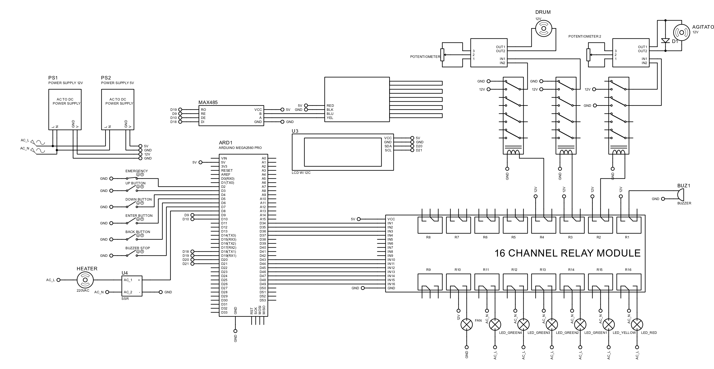
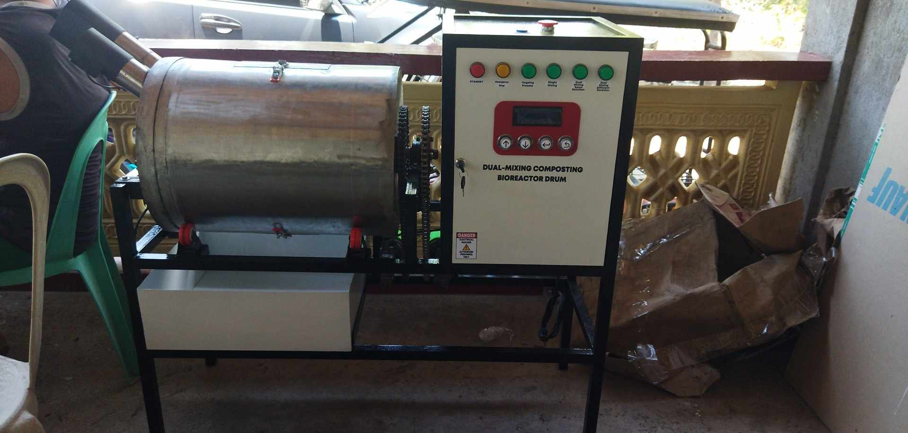
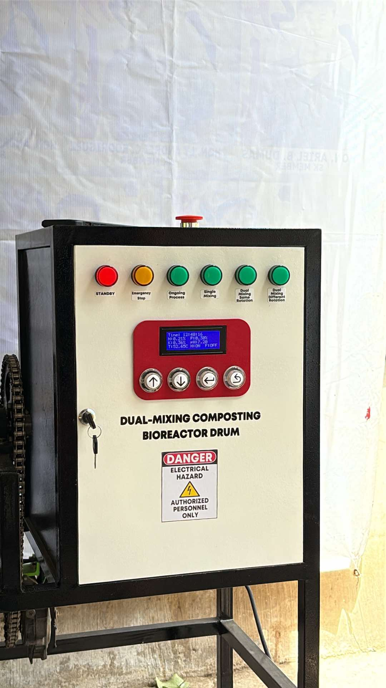

# Dual Mixing Bioreactor Drum Control System

This project is an Arduino Mega-based automated **dual mixing bioreactor system** designed to control and monitor a bioreactor drum and agitator. It integrates temperature regulation, nutrient monitoring (NPK and pH), motor control, and safety mechanisms to ensure optimal biological processing conditions.

---

## Project Overview

The system controls a **bioreactor drum with dual mixing mechanisms**:

- Agitator (primary mixing motor)  
- Rotating drum (clockwise and counterclockwise control)  

It also monitors critical parameters:

- Temperature  
- Nitrogen (N)  
- Phosphorous (P)  
- Potassium (K)  
- pH level  

The system automatically:
- maintains optimal environmental conditions  
- controls heating and cooling  
- stops operation when setpoints are reached  
- ensures safe operation with emergency controls  

---

## Features

### 🔄 Dual Mixing Control

Supports multiple operating modes:

- Agitator Only  
- Agitator + Drum (Clockwise)  
- Agitator + Drum (Counterclockwise)  
- Manual Drum Control  

---

### 🌡️ Temperature Control

- Maintains temperature between **45°C and 55°C**
- Uses:
  - Heater (for increasing temperature)  
  - Fan (for cooling)  

Control logic:
- Heater turns ON when temperature is below minimum  
- Fan turns ON when temperature exceeds maximum  

---

### 🧪 Nutrient Monitoring (NPK + pH)

Monitors real-time values for:

- Nitrogen (N)  
- Phosphorous (P)  
- Potassium (K)  
- pH  

Setpoint ranges:

| Parameter   | Range        |
|------------|-------------|
| Nitrogen   | 0.15 – 0.5  |
| Phosphorous| 0.2 – 0.8   |
| Potassium  | 0.25 – 0.5  |
| pH         | 6.5 – 7.5   |

---

### ⏱️ Process Timer

- Tracks:
  - Hours  
  - Minutes  
  - Seconds  
- Displays real-time process duration  

---

### 📺 LCD Interface

- 20x4 I2C LCD display  
- Shows:
  - current mode  
  - process time  
  - sensor readings  
  - heater and fan status  

---

### 🔘 User Control Panel

Buttons:

- UP → Navigate options  
- DOWN → Navigate options  
- ENTER → Confirm selection  
- BACK → Return to previous menu  
- BUZZER STOP → Stop alarm  

---

### 🚨 Safety Features

#### Emergency Stop
- Immediately shuts down:
  - motors  
  - heater  
  - fan  
- Displays **EMERGENCY STOP** on LCD  

---

#### Buzzer Alarm
- Activates when process is complete  
- Can be manually turned off  

---

### 🚦 Status Indicators

Pilot lights provide system status:

| Light       | Meaning              |
|------------|---------------------|
| Red         | Idle / standby       |
| Yellow      | Emergency state      |
| Green LEDs  | Active operation     |

---

## System Workflow

### 1. Initialization
- System powers on  
- LCD displays startup message  

---

### 2. Mode Selection
User selects one of the following:

1. Agitator Only  
2. Agitator + Drum (CW)  
3. Agitator + Drum (CCW)  
4. Manual Drum Control  

---

### 3. Process Execution
- Motors operate based on selected mode  
- Heater and fan regulate temperature  
- Sensors continuously monitor:
  - N, P, K  
  - pH  
  - Temperature  

---

### 4. Setpoint Monitoring
The system checks if all parameters are within safe range:

- If not → continue operation  
- If yes → proceed to completion  

---

### 5. Completion
- Stops all motors  
- Activates buzzer  
- Displays **PROCESS DONE**  

---

### 6. Emergency Handling
- Triggered via emergency button  
- Immediately shuts down entire system  

---

## Pin Configuration

### Motors and Actuators

| Component        | Pin |
|------------------|-----|
| Drum Motor A     | 36  |
| Drum Motor B     | 37  |
| Agitator Motor   | 35  |
| Heater           | 8   |
| Fan              | 38  |

---

### User Inputs

| Component        | Pin |
|------------------|-----|
| UP Button        | 3   |
| DOWN Button      | 4   |
| ENTER Button     | 5   |
| BACK Button      | 6   |
| Buzzer Stop      | 7   |
| Emergency Button | 2   |

---

### Indicators

| Component        | Pin |
|------------------|-----|
| Red LED          | 49  |
| Yellow LED       | 48  |
| Green LEDs       | 44–47 |

---

### Communication

| Component        | Pin |
|------------------|-----|
| RS485 RE         | 10  |
| RS485 DE         | 11  |
| Sensor Comm      | Serial1 |

---

## Wiring Diagram

Refer to the wiring diagram below for full system connections:

📄 Bioreactor Wiring Diagram  
:contentReference[oaicite:0]{index=0}  

### Key Highlights:

- Arduino Mega 2560 used as controller  
- MAX485 module for RS485 communication  
- 16-channel relay module for controlling loads  
- AC heater controlled via SSR  
- Separate power supplies:
  - 12V for motors  
  - 5V for logic components  
- LCD connected via I2C (SDA/SCL)  

---

## Hardware Components

- Arduino Mega 2560  
- AC Drum Motor  
- Agitator Motor  
- Heater (with SSR)  
- Cooling Fan  
- MAX485 Module  
- 16-Channel Relay Module  
- NPK Sensor (RS485)  
- LCD 20x4 I2C  
- Push Buttons  
- Buzzer  
- LED Indicators  
- Power Supplies (5V and 12V)  

---

## Key Functions

### Setpoint Check

Ensures all parameters meet required conditions before completing the process.

---

### Sensor Communication

- Uses RS485 (Modbus protocol)
- Reads sensor registers for:
  - temperature
  - pH
  - nutrients

---

### Motor Control

- Supports forward, reverse, and stop operations
- Independent control of:
  - drum
  - agitator

This project demonstrates a complete automated dual mixing bioreactor system that combines:

dual motor mixing (drum and agitator)
environmental control (temperature regulation)
chemical monitoring (NPK and pH)
safety systems (emergency stop and alarms)
user interface (LCD and control buttons)

It is suitable for:

composting systems
fermentation processes
agricultural bioreactors
industrial mixing automation

---

## Notes

- Uses **Chrono library** for non-blocking timing  
- RS485 communication requires correct RE/DE pin control  
- Heater is controlled using a **Solid State Relay (SSR)**  
- LCD provides real-time system monitoring  
- Ensure proper wiring for motors and relays to avoid damage  

---

## Limitations

- No cloud or IoT integration  
- Threshold-based control (no PID or adaptive control)  
- Requires calibration of NPK and pH sensors  
- System accuracy depends on RS485 sensor reliability  
- No remote monitoring or logging system  

---

## Summary

This project demonstrates a complete **automated dual mixing bioreactor system** that combines:

- dual motor mixing (drum and agitator)  
- environmental control (temperature regulation)  
- chemical monitoring (NPK and pH)  
- safety systems (emergency stop and alarms)  
- user interface (LCD and control buttons)  

It is suitable for:

- composting systems  
- fermentation processes  
- agricultural bioreactors  
- industrial mixing automation

## Wiring Diagram

## Pictures

